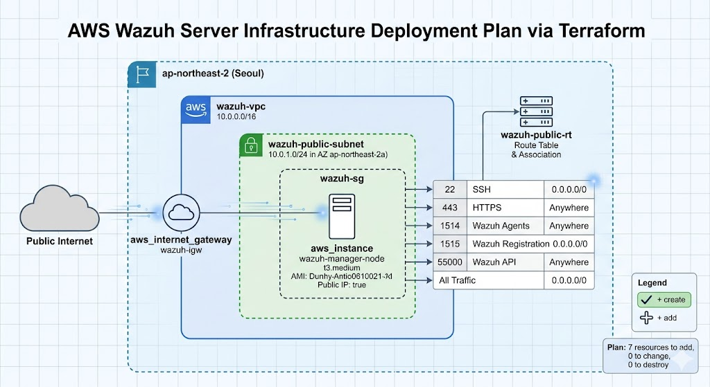

# 🛡️ Wazuh AWS 인프라 자동 구축 프로비저닝 (Terraform)

이 프로젝트는 오픈소스 보안 모니터링 플랫폼인 **Wazuh**를 운영하기 위한 AWS 클라우드 인프라(네트워크, 방화벽, 컴퓨팅)를 Terraform을 통해 코드로 안전하고 빠르게 구축(IaC)하는 템플릿입니다.

기존의 복잡한 오픈소스 코드를 복사하지 않고, AWS 공식 모범 사례(Clean Room 설계)를 바탕으로 처음부터 작성되어 라이선스 제약 없이 자유롭게 사용 및 수정이 가능합니다.

---

## 🏗️ 아키텍처 구성 요소

이 코드를 실행하면 AWS 서울 리전(`ap-northeast-2`)에 다음 자원들이 자동으로 생성됩니다.

1. **Network (`network.tf`)**
    * VPC (10.0.0.0/16) 및 퍼블릭 서브넷 (10.0.1.0/24)
    * 인터넷 게이트웨이(IGW) 및 라우팅 테이블
2. **Security (`security.tf`)**
    * 외부 통신을 제어하는 보안 그룹(Security Group)
    * 개방 포트: `22` (SSH), `443` (Dashboard), `1514` (Agent Log), `1515` (Agent Enrollment), `55000` (API)
3. **Compute (`compute.tf`)**
    * 최신 Ubuntu 20.04 LTS (자동 검색 적용)
    * `t3.medium` 인스턴스 (Wazuh 권장 최소 사양) 및 공인 IP 자동 할당

---

## 📋 사전 준비 사항 (Prerequisites)

이 프로젝트를 실행하기 전에 본인의 PC에 다음 도구들이 설치되어 있어야 합니다.

* [Terraform](https://developer.hashicorp.com/terraform/downloads) (v1.0.0 이상)
* [AWS CLI](https://aws.amazon.com/ko/cli/)
* AWS IAM 계정 (Access Key 및 Secret Key)

**AWS 자격 증명 설정:**
터미널을 열고 아래 명령어를 통해 AWS 접속 정보를 로컬 환경에 세팅합니다.
```bash
aws configure
# Access Key, Secret Key, region(ap-northeast-2), format(json) 입력